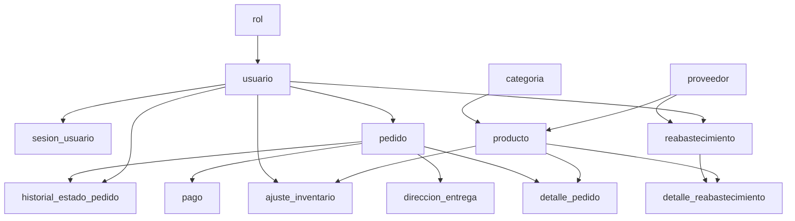

# Diseno de Base de Datos

## 1. Alcance del modelo

Este diseno parte de las decisiones ya aprobadas para el proyecto:

- Frontend unico en Vue con tres superficies: storefront publico, area de cuenta cliente y back office admin.
- Backend unico en FastAPI con SQL explicito y sin ORM.
- PostgreSQL como DBMS.
- Checkout real desde el storefront.
- Pago simulado interno, sin integracion futura con pasarelas reales.
- Soporte para delivery y pickup.
- Guest checkout permitido.
- Usuarios registrados con perfil e historial de pedidos.
- Admin autenticado, sembrado en base de datos, con acceso tanto al back office como a las rutas cliente.
- Productos simples de un solo SKU.
- Reabastecimiento liviano mas ajustes directos de stock.

La meta de este modelo es priorizar claridad academica y cobertura de rubrica sobre complejidad empresarial.

## 2. Entidades principales

- `rol`: separa permisos `admin` y `cliente`.
- `usuario`: almacena cuentas autenticadas; invitados no requieren cuenta.
- `sesion_usuario`: permite login/logout con sesion persistida.
- `categoria`: agrupa productos.
- `proveedor`: referencia simple para abastecimiento.
- `producto`: catalogo, precio y stock actual.
- `pedido`: encabezado de compra, ya sea invitado o usuario registrado.
- `direccion_entrega`: direccion solo cuando el pedido es `delivery`.
- `detalle_pedido`: productos vendidos por pedido.
- `pago`: resultado del pago simulado.
- `historial_estado_pedido`: trazabilidad de cambios de estado.
- `reabastecimiento`: encabezado liviano de ingreso de stock.
- `detalle_reabastecimiento`: productos y cantidades ingresadas.
- `ajuste_inventario`: cambios directos de stock hechos por admin.

## 3. DER inicial


## 4. DDL inicial en Mermaid

El siguiente diagrama no sustituye el script SQL final; sirve para visualizar el orden logico de creacion y dependencias FK.



## 5. Bosquejo DDL SQL

Esto sigue siendo diseno, no implementacion final. El objetivo es fijar estructura y restricciones principales.

```sql
CREATE TABLE rol (
    id_rol SMALLSERIAL PRIMARY KEY,
    nombre VARCHAR(20) NOT NULL UNIQUE
);

CREATE TABLE usuario (
    id_usuario BIGSERIAL PRIMARY KEY,
    id_rol SMALLINT NOT NULL REFERENCES rol(id_rol),
    email VARCHAR(255) NOT NULL UNIQUE,
    password_hash VARCHAR(255) NOT NULL,
    nombre VARCHAR(100) NOT NULL,
    apellido VARCHAR(100) NOT NULL,
    telefono VARCHAR(30),
    activo BOOLEAN NOT NULL DEFAULT TRUE,
    creado_en TIMESTAMP NOT NULL DEFAULT CURRENT_TIMESTAMP
);

CREATE TABLE categoria (
    id_categoria BIGSERIAL PRIMARY KEY,
    nombre VARCHAR(120) NOT NULL UNIQUE,
    descripcion TEXT,
    activa BOOLEAN NOT NULL DEFAULT TRUE
);

CREATE TABLE proveedor (
    id_proveedor BIGSERIAL PRIMARY KEY,
    nombre VARCHAR(150) NOT NULL,
    contacto VARCHAR(150),
    email VARCHAR(255),
    telefono VARCHAR(30),
    activo BOOLEAN NOT NULL DEFAULT TRUE
);

CREATE TABLE producto (
    id_producto BIGSERIAL PRIMARY KEY,
    id_categoria BIGINT NOT NULL REFERENCES categoria(id_categoria),
    id_proveedor BIGINT REFERENCES proveedor(id_proveedor),
    sku VARCHAR(60) NOT NULL UNIQUE,
    nombre VARCHAR(150) NOT NULL,
    descripcion TEXT,
    precio_unitario NUMERIC(12,2) NOT NULL CHECK (precio_unitario >= 0),
    stock_actual INTEGER NOT NULL CHECK (stock_actual >= 0),
    activo BOOLEAN NOT NULL DEFAULT TRUE,
    creado_en TIMESTAMP NOT NULL DEFAULT CURRENT_TIMESTAMP,
    actualizado_en TIMESTAMP NOT NULL DEFAULT CURRENT_TIMESTAMP
);

CREATE TABLE pedido (
    id_pedido BIGSERIAL PRIMARY KEY,
    id_usuario BIGINT REFERENCES usuario(id_usuario),
    codigo_publico VARCHAR(40) NOT NULL UNIQUE,
    nombre_cliente VARCHAR(150) NOT NULL,
    email_cliente VARCHAR(255) NOT NULL,
    telefono_cliente VARCHAR(30),
    tipo_entrega VARCHAR(20) NOT NULL CHECK (tipo_entrega IN ('delivery', 'pickup')),
    estado_pedido VARCHAR(30) NOT NULL,
    estado_pago VARCHAR(30) NOT NULL,
    nota_cliente TEXT,
    creado_en TIMESTAMP NOT NULL DEFAULT CURRENT_TIMESTAMP,
    confirmado_en TIMESTAMP
);
```

## 6. Modelo relacional documentado

Notacion relacional inicial:

- `ROL(`id_rol` PK, nombre UQ)`
- `USUARIO(`id_usuario` PK, id_rol FK -> ROL.id_rol, email UQ, password_hash, nombre, apellido, telefono, activo, creado_en)`
- `SESION_USUARIO(`id_sesion` PK, id_usuario FK -> USUARIO.id_usuario, token_hash UQ, creada_en, expira_en, revocada_en)`
- `CATEGORIA(`id_categoria` PK, nombre UQ, descripcion, activa)`
- `PROVEEDOR(`id_proveedor` PK, nombre, contacto, email, telefono, activo)`
- `PRODUCTO(`id_producto` PK, id_categoria FK -> CATEGORIA.id_categoria, id_proveedor FK -> PROVEEDOR.id_proveedor, sku UQ, nombre, descripcion, precio_unitario, stock_actual, activo, creado_en, actualizado_en)`
- `PEDIDO(`id_pedido` PK, id_usuario FK -> USUARIO.id_usuario NULL, codigo_publico UQ, nombre_cliente, email_cliente, telefono_cliente, tipo_entrega, estado_pedido, estado_pago, nota_cliente, creado_en, confirmado_en)`
- `DIRECCION_ENTREGA(`id_direccion_entrega` PK, id_pedido FK -> PEDIDO.id_pedido UQ, linea_1, linea_2, ciudad, departamento, referencia)`
- `DETALLE_PEDIDO(`id_detalle_pedido` PK, id_pedido FK -> PEDIDO.id_pedido, id_producto FK -> PRODUCTO.id_producto, cantidad, precio_unitario, UQ(id_pedido, id_producto))`
- `PAGO(`id_pago` PK, id_pedido FK -> PEDIDO.id_pedido UQ, metodo, monto, estado, codigo_simulado, procesado_en)`
- `HISTORIAL_ESTADO_PEDIDO(`id_historial` PK, id_pedido FK -> PEDIDO.id_pedido, id_usuario FK -> USUARIO.id_usuario NULL, estado_anterior, estado_nuevo, nota, creado_en)`
- `REABASTECIMIENTO(`id_reabastecimiento` PK, id_proveedor FK -> PROVEEDOR.id_proveedor NULL, id_admin FK -> USUARIO.id_usuario, nota, creado_en)`
- `DETALLE_REABASTECIMIENTO(`id_detalle_reab` PK, id_reabastecimiento FK -> REABASTECIMIENTO.id_reabastecimiento, id_producto FK -> PRODUCTO.id_producto, cantidad, costo_unitario, UQ(id_reabastecimiento, id_producto))`
- `AJUSTE_INVENTARIO(`id_ajuste` PK, id_producto FK -> PRODUCTO.id_producto, id_admin FK -> USUARIO.id_usuario, cantidad_delta, motivo, creado_en)`

## 7. Normalizacion hasta 3FN

### 7.1 Punto de partida no normalizado

Si todo se intentara guardar en una sola estructura de "venta de tienda", aparecerian problemas clasicos:

- multiples productos repetidos dentro del mismo pedido;
- datos de categoria y proveedor repetidos en cada producto vendido;
- direccion de delivery mezclada con pedidos pickup;
- datos de pago incrustados en el pedido;
- historial de estados sobrescrito en una sola columna;
- reabastecimientos y ajustes sin trazabilidad separada.

Ese punto de partida generaria redundancia, anomalias de insercion y dificultad para justificar consultas complejas.

### 7.2 Primera forma normal (1FN)

El modelo propuesto cumple 1FN porque:

- cada tabla tiene clave primaria;
- todos los atributos son atomicos;
- los grupos repetitivos se separan en tablas detalle:
  - `DETALLE_PEDIDO`
  - `DETALLE_REABASTECIMIENTO`
- la direccion de entrega se separa de `PEDIDO` y solo existe cuando el pedido es delivery.

### 7.3 Segunda forma normal (2FN)

El modelo propuesto cumple 2FN porque:

- las tablas detalle usan PK sustituta y tambien restricciones unicas de negocio;
- no quedan atributos que dependan de solo una parte de una clave compuesta;
- en `DETALLE_PEDIDO`, `cantidad` y `precio_unitario` dependen de la fila completa de detalle, no solo del pedido ni solo del producto;
- en `DETALLE_REABASTECIMIENTO`, `cantidad` y `costo_unitario` dependen del detalle completo del evento de reabastecimiento.

### 7.4 Tercera forma normal (3FN)

El modelo propuesto cumple 3FN por estas separaciones:

- `ROL` se separa de `USUARIO`, evitando que el nombre del rol dependa transitivamente del usuario.
- `CATEGORIA` y `PROVEEDOR` se separan de `PRODUCTO`, evitando repetir nombres o contactos dentro de cada producto.
- `DIRECCION_ENTREGA` se separa de `PEDIDO`, evitando atributos que solo aplican a delivery.
- `PAGO` se separa de `PEDIDO`, evitando mezclar logica comercial con resultado de pago.
- `HISTORIAL_ESTADO_PEDIDO` se separa de `PEDIDO`, evitando columnas repetidas o perdida de trazabilidad.
- `REABASTECIMIENTO`, `DETALLE_REABASTECIMIENTO` y `AJUSTE_INVENTARIO` separan los distintos origenes del cambio de stock.
- en `PEDIDO`, los campos `nombre_cliente`, `email_cliente` y `telefono_cliente` son una fotografia del momento de compra; dependen directamente de `id_pedido`, no del usuario, por lo que se justifican para preservar historial aunque el perfil del cliente cambie despues.

### 7.5 Observaciones de diseno

- `stock_actual` en `PRODUCTO` es un valor almacenado y mantenido transaccionalmente. Se conserva por simplicidad operativa y porque el proyecto requiere una UX de inventario directa. La trazabilidad del origen del cambio queda en `DETALLE_REABASTECIMIENTO`, `AJUSTE_INVENTARIO` y `DETALLE_PEDIDO`.
- agregados de reporteria, como ventas por rango o top productos, deben salir de queries, views o CTEs; no deben almacenarse como columnas redundantes.

## 8. Flujos transaccionales clave

### 8.1 Checkout con pedido real

Objetivo: crear el pedido, procesar el pago simulado y descontar stock de manera consistente.

Pasos logicos:

1. `BEGIN`
2. `SET TRANSACTION ISOLATION LEVEL SERIALIZABLE`
3. validar carrito no vacio;
4. leer productos del carrito con bloqueo para escritura (`SELECT ... FOR UPDATE`);
5. verificar que todos los productos sigan activos y con stock suficiente;
6. insertar `PEDIDO`;
7. insertar `DETALLE_PEDIDO`;
8. calcular monto y registrar `PAGO`;
9. si el pago simulado es aprobado:
   - actualizar `PRODUCTO.stock_actual = stock_actual - cantidad`;
   - registrar eventos en `HISTORIAL_ESTADO_PEDIDO`;
   - marcar `estado_pago = 'approved'`;
   - marcar `estado_pedido = 'confirmed'`;
10. si el pago simulado es rechazado:
   - registrar `PAGO.estado = 'rejected'`;
   - marcar `estado_pedido = 'cancelled'` o `payment_failed`;
   - no descontar stock;
11. `COMMIT`
12. ante conflicto de serializacion, error SQL o stock insuficiente: `ROLLBACK`

Estados frontend sugeridos para checkout:

- `validating_cart`
- `checking_stock`
- `processing_payment`
- `confirmed`
- `payment_rejected`
- `stock_conflict`
- `system_error`

Esto cumple con la necesidad de que el cliente tenga visibilidad del proceso transaccional durante checkout y en la pantalla final de confirmacion.

### 8.2 Reabastecimiento liviano

Objetivo: ingresar stock de forma trazable pero sin modelar compras empresariales complejas.

Pasos:

1. `BEGIN`
2. insertar `REABASTECIMIENTO`
3. insertar `DETALLE_REABASTECIMIENTO`
4. actualizar `PRODUCTO.stock_actual = stock_actual + cantidad` para cada producto afectado
5. `COMMIT`
6. ante error: `ROLLBACK`

Esto deja historial suficiente para reportes por proveedor o ingresos de stock por periodo.

### 8.3 Ajuste directo de inventario

Objetivo: permitir correcciones administrativas simples.

Pasos:

1. `BEGIN`
2. bloquear el producto a ajustar
3. insertar `AJUSTE_INVENTARIO`
4. actualizar `PRODUCTO.stock_actual = stock_actual + cantidad_delta`
5. validar que el stock no quede negativo
6. `COMMIT`
7. si el resultado es invalido: `ROLLBACK`

### 8.4 Login con sesion

Objetivo: cumplir con autenticacion admin y cliente sin introducir complejidad innecesaria.

Pasos:

1. validar credenciales contra `USUARIO`
2. crear token o identificador de sesion
3. guardar hash del token en `SESION_USUARIO`
4. al logout, marcar `revocada_en`

Esto permite login/logout con sesion real, compatible con la rubrica.

## 9. Consultas y objetos SQL que esta base deberia soportar

Para alinear el diseno con la rubrica, este modelo debe facilitar:

- joins:
  - pedidos con usuario, pago y detalle;
  - productos con categoria y proveedor;
  - reabastecimientos con proveedor y detalle.
- subqueries:
  - productos con ventas en cierto rango;
  - categorias con existencia de ventas o restocks.
- agregaciones:
  - ventas por fecha;
  - top productos;
  - stock bajo.
- al menos una `VIEW`, por ejemplo:
  - `vw_resumen_ventas`
- al menos una consulta con `CTE`, por ejemplo:
  - ranking de productos mas vendidos en un periodo

## 10. Indices iniciales sugeridos

Ademas de PK y UQ:

- `CREATE INDEX idx_producto_categoria ON producto(id_categoria);`
- `CREATE INDEX idx_producto_stock_actual ON producto(stock_actual);`
- `CREATE INDEX idx_pedido_creado_en ON pedido(creado_en);`
- `CREATE INDEX idx_pedido_usuario_creado ON pedido(id_usuario, creado_en);`
- `CREATE INDEX idx_detalle_pedido_producto ON detalle_pedido(id_producto);`
- `CREATE INDEX idx_pago_estado ON pago(estado);`

## 11. Decisiones abiertas antes de implementar

Estas decisiones ya no bloquean el diseno de BD, pero si afectaran el detalle de API y UI:

- formato exacto de sesion: cookie server-side o token firmado;
- catalogo de estados final para `estado_pedido` y `estado_pago`;
- reglas exactas de auto-progresion de pedidos despues de checkout exitoso;
- campos exactos del formulario de delivery.
