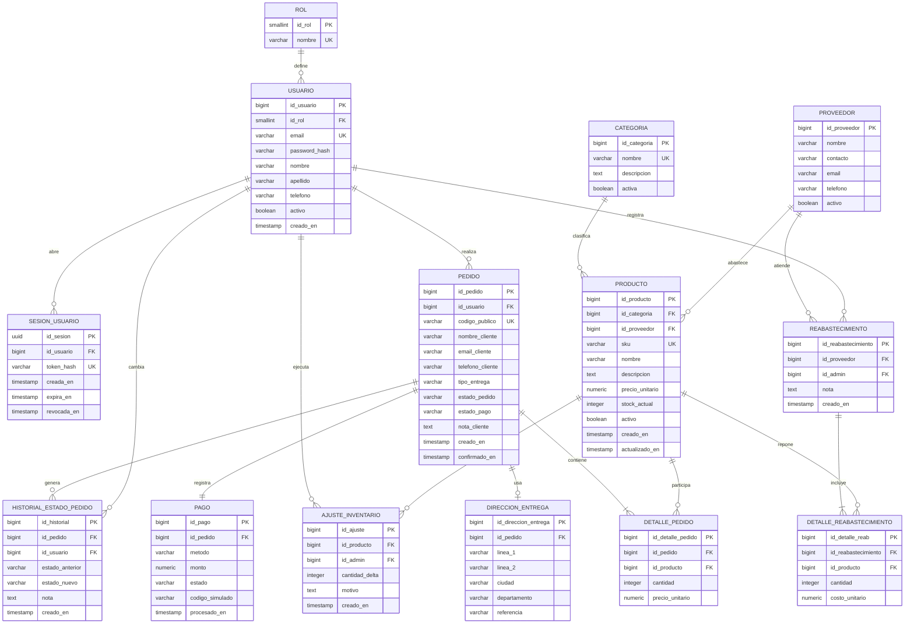

# Diseno de Base de Datos

## 1. Proposito del documento

Este archivo deja documentada en el repositorio toda la seccion `I. Diseno de base de datos` de la rubrica del proyecto. La idea es que el lector pueda encontrar en un solo lugar:

- el modelo conceptual;
- el modelo relacional;
- la justificacion de normalizacion hasta 3FN;
- la relacion entre el diseno y el DDL ejecutable;
- la estrategia de indices;
- el estado y la estrategia del script de datos de prueba.

La evidencia ejecutable del diseno vive en estos archivos:

- `db/init/001_schema.sql`: DDL fisico, indices y `VIEW`.
- `db/init/002_seed.sql`: datos de arranque y base para las semillas de prueba.

## 2. Trazabilidad contra la rubrica

La seccion `I. Diseno de base de datos` del PDF pide estos entregables:

| Criterio del PDF | Donde queda documentado en el repo | Evidencia ejecutable |
| --- | --- | --- |
| Diagrama ER correcto: entidades, atributos, relaciones y cardinalidades | Secciones 4, 5 y 6 de este documento | `db/init/001_schema.sql` |
| Modelo relacional documentado | Seccion 7 de este documento | `db/init/001_schema.sql` |
| Normalizacion justificada hasta 3FN: dependencias funcionales y pasos aplicados | Seccion 8 de este documento | Se refleja en la separacion de tablas del esquema |
| DDL completo con `PRIMARY KEY`, `FOREIGN KEY` y `NOT NULL` | Seccion 9 de este documento | `db/init/001_schema.sql` |
| Script de datos de prueba realistas | Seccion 11 de este documento | `db/init/002_seed.sql` |
| Indices definidos explicitamente y justificados | Seccion 10 de este documento | `db/init/001_schema.sql` |

## 3. Alcance y decisiones de negocio

Este diseno parte de las decisiones ya aprobadas para el proyecto:

- Frontend unico en Vue con tres superficies: storefront publico, area de cuenta cliente y back office admin.
- Backend unico en FastAPI con SQL explicito y sin ORM.
- PostgreSQL como DBMS.
- Pago simulado interno, sin integracion con pasarelas reales.
- Soporte para `delivery` y `pickup`.
- Guest checkout permitido.
- Usuarios registrados con perfil e historial de pedidos.
- Admin autenticado, sembrado en la base, con acceso al back office y a rutas cliente.
- Productos simples de un solo SKU.
- Reabastecimiento liviano mas ajustes directos de stock.

La meta del modelo es priorizar claridad academica, trazabilidad de reglas de negocio y soporte para la parte SQL/transaccional del proyecto.

## 4. Entidades principales

- `rol`: define los tipos de usuario del sistema (`admin`, `cliente`).
- `usuario`: almacena cuentas autenticadas.
- `sesion_usuario`: conserva sesiones de login/logout.
- `categoria`: clasifica productos del catalogo.
- `proveedor`: registra origen de abastecimiento.
- `producto`: representa el SKU vendible y su stock actual.
- `pedido`: encabezado de cada compra, hecha por invitado o usuario registrado.
- `direccion_entrega`: se usa solo cuando el pedido es `delivery`.
- `detalle_pedido`: productos, cantidades y precios aplicados en el pedido.
- `pago`: resultado del pago simulado.
- `historial_estado_pedido`: historial de cambios de estado del pedido.
- `reabastecimiento`: ingreso de inventario por proveedor o carga administrativa.
- `detalle_reabastecimiento`: detalle por producto dentro de un reabastecimiento.
- `ajuste_inventario`: correccion directa de stock hecha por admin.

## 5. Relaciones y cardinalidades

| Relacion | Cardinalidad | Obligatoria | Regla de negocio |
| --- | --- | --- | --- |
| `ROL` -> `USUARIO` | 1:N | Todo usuario debe tener rol | Un rol puede pertenecer a muchos usuarios |
| `USUARIO` -> `SESION_USUARIO` | 1:N | Toda sesion pertenece a un usuario | Un usuario puede iniciar varias sesiones |
| `CATEGORIA` -> `PRODUCTO` | 1:N | Todo producto debe tener categoria | Una categoria agrupa muchos productos |
| `PROVEEDOR` -> `PRODUCTO` | 1:N opcional | El producto puede no tener proveedor inicial | Un proveedor puede abastecer varios productos |
| `USUARIO` -> `PEDIDO` | 1:N opcional | Un pedido puede no tener usuario por guest checkout | Un cliente registrado puede tener muchos pedidos |
| `PEDIDO` -> `DIRECCION_ENTREGA` | 1:0..1 | Solo aplica a `delivery` | Un pedido `pickup` no necesita direccion |
| `PEDIDO` -> `DETALLE_PEDIDO` | 1:N | Todo pedido debe tener al menos un detalle | Un detalle pertenece a un solo pedido |
| `PRODUCTO` -> `DETALLE_PEDIDO` | 1:N | Todo detalle referencia un producto | Un producto puede aparecer en muchos pedidos |
| `PEDIDO` -> `PAGO` | 1:1 | Todo pedido confirmado debe tener pago asociado | El modelo maneja un pago por pedido |
| `PEDIDO` -> `HISTORIAL_ESTADO_PEDIDO` | 1:N | El historial depende del pedido | Un pedido puede cambiar de estado varias veces |
| `USUARIO` -> `HISTORIAL_ESTADO_PEDIDO` | 1:N opcional | Puede ser `NULL` si el cambio fue automatico | Conserva trazabilidad del actor |
| `PROVEEDOR` -> `REABASTECIMIENTO` | 1:N opcional | Puede existir carga manual sin proveedor | Un proveedor puede atender muchos ingresos |
| `USUARIO` -> `REABASTECIMIENTO` | 1:N | Todo reabastecimiento debe tener admin responsable | |
| `REABASTECIMIENTO` -> `DETALLE_REABASTECIMIENTO` | 1:N | Todo ingreso debe tener detalle | |
| `PRODUCTO` -> `DETALLE_REABASTECIMIENTO` | 1:N | Todo detalle de reabastecimiento referencia producto | |
| `USUARIO` -> `AJUSTE_INVENTARIO` | 1:N | Todo ajuste directo debe quedar asociado a admin | |
| `PRODUCTO` -> `AJUSTE_INVENTARIO` | 1:N | Todo ajuste afecta un producto | |

## 6. DER documentado

## 7. Modelo relacional documentado

Notacion relacional del esquema:

- `ROL(`id_rol` PK, nombre UQ)`
- `USUARIO(`id_usuario` PK, id_rol FK -> ROL.id_rol, email UQ, password_hash, nombre, apellido, telefono, activo, creado_en)`
- `SESION_USUARIO(`id_sesion` PK, id_usuario FK -> USUARIO.id_usuario, token_hash UQ, creada_en, expira_en, revocada_en)`
- `CATEGORIA(`id_categoria` PK, nombre UQ, descripcion, activa)`
- `PROVEEDOR(`id_proveedor` PK, nombre, contacto, email, telefono, activo)`
- `PRODUCTO(`id_producto` PK, id_categoria FK -> CATEGORIA.id_categoria, id_proveedor FK -> PROVEEDOR.id_proveedor NULL, sku UQ, nombre, descripcion, precio_unitario, stock_actual, activo, creado_en, actualizado_en)`
- `PEDIDO(`id_pedido` PK, id_usuario FK -> USUARIO.id_usuario NULL, codigo_publico UQ, nombre_cliente, email_cliente, telefono_cliente, tipo_entrega, estado_pedido, estado_pago, nota_cliente, creado_en, confirmado_en)`
- `DIRECCION_ENTREGA(`id_direccion_entrega` PK, id_pedido FK -> PEDIDO.id_pedido UQ, linea_1, linea_2, ciudad, departamento, referencia)`
- `DETALLE_PEDIDO(`id_detalle_pedido` PK, id_pedido FK -> PEDIDO.id_pedido, id_producto FK -> PRODUCTO.id_producto, cantidad, precio_unitario, UQ(id_pedido, id_producto))`
- `PAGO(`id_pago` PK, id_pedido FK -> PEDIDO.id_pedido UQ, metodo, monto, estado, codigo_simulado UQ, procesado_en)`
- `HISTORIAL_ESTADO_PEDIDO(`id_historial` PK, id_pedido FK -> PEDIDO.id_pedido, id_usuario FK -> USUARIO.id_usuario NULL, estado_anterior, estado_nuevo, nota, creado_en)`
- `REABASTECIMIENTO(`id_reabastecimiento` PK, id_proveedor FK -> PROVEEDOR.id_proveedor NULL, id_admin FK -> USUARIO.id_usuario, nota, creado_en)`
- `DETALLE_REABASTECIMIENTO(`id_detalle_reab` PK, id_reabastecimiento FK -> REABASTECIMIENTO.id_reabastecimiento, id_producto FK -> PRODUCTO.id_producto, cantidad, costo_unitario, UQ(id_reabastecimiento, id_producto))`
- `AJUSTE_INVENTARIO(`id_ajuste` PK, id_producto FK -> PRODUCTO.id_producto, id_admin FK -> USUARIO.id_usuario, cantidad_delta, motivo, creado_en)`

## 8. Normalizacion hasta 3FN

### 8.1 Punto de partida no normalizado

Si toda la operacion de tienda se intentara guardar en una sola estructura, aparecerian columnas repetidas y dependencias mezcladas, por ejemplo:

`VENTA_BRUTA(id_venta, fecha, cliente, email_cliente, telefono_cliente, direccion_delivery, tipo_entrega, producto_1, categoria_1, proveedor_1, cantidad_1, precio_1, producto_2, categoria_2, proveedor_2, cantidad_2, precio_2, pago_estado, pago_metodo, estado_actual, estado_previo, admin_que_modifico, restock_relacionado, ajuste_relacionado, ...)`

Ese diseno produciria:

- grupos repetitivos de productos por venta;
- repeticion de categoria y proveedor en cada linea;
- mezcla de datos opcionales de `delivery` con `pickup`;
- mezcla de resultado de pago con encabezado de pedido;
- perdida de trazabilidad de estados si solo existiera `estado_actual`;
- imposibilidad de justificar movimientos de stock por origen.

### 8.2 Dependencias funcionales principales

Las dependencias que justifican el modelo separado son:

- `ROL`
  - `id_rol -> nombre`
  - `nombre -> id_rol`
- `USUARIO`
  - `id_usuario -> id_rol, email, password_hash, nombre, apellido, telefono, activo, creado_en`
  - `email -> id_usuario, id_rol, password_hash, nombre, apellido, telefono, activo, creado_en`
- `SESION_USUARIO`
  - `id_sesion -> id_usuario, token_hash, creada_en, expira_en, revocada_en`
  - `token_hash -> id_sesion, id_usuario, creada_en, expira_en, revocada_en`
- `CATEGORIA`
  - `id_categoria -> nombre, descripcion, activa`
  - `nombre -> id_categoria, descripcion, activa`
- `PROVEEDOR`
  - `id_proveedor -> nombre, contacto, email, telefono, activo`
- `PRODUCTO`
  - `id_producto -> id_categoria, id_proveedor, sku, nombre, descripcion, precio_unitario, stock_actual, activo, creado_en, actualizado_en`
  - `sku -> id_producto, id_categoria, id_proveedor, nombre, descripcion, precio_unitario, stock_actual, activo, creado_en, actualizado_en`
- `PEDIDO`
  - `id_pedido -> id_usuario, codigo_publico, nombre_cliente, email_cliente, telefono_cliente, tipo_entrega, estado_pedido, estado_pago, nota_cliente, creado_en, confirmado_en`
  - `codigo_publico -> id_pedido, id_usuario, nombre_cliente, email_cliente, telefono_cliente, tipo_entrega, estado_pedido, estado_pago, nota_cliente, creado_en, confirmado_en`
- `DIRECCION_ENTREGA`
  - `id_direccion_entrega -> id_pedido, linea_1, linea_2, ciudad, departamento, referencia`
  - `id_pedido -> linea_1, linea_2, ciudad, departamento, referencia`
- `DETALLE_PEDIDO`
  - clave natural de negocio: `(id_pedido, id_producto) -> cantidad, precio_unitario`
  - la PK sustituta `id_detalle_pedido` identifica la fila, pero la dependencia de negocio sigue siendo la compuesta
- `PAGO`
  - `id_pago -> id_pedido, metodo, monto, estado, codigo_simulado, procesado_en`
  - `id_pedido -> metodo, monto, estado, codigo_simulado, procesado_en`
  - `codigo_simulado -> id_pago, id_pedido, metodo, monto, estado, procesado_en`
- `HISTORIAL_ESTADO_PEDIDO`
  - `id_historial -> id_pedido, id_usuario, estado_anterior, estado_nuevo, nota, creado_en`
- `REABASTECIMIENTO`
  - `id_reabastecimiento -> id_proveedor, id_admin, nota, creado_en`
- `DETALLE_REABASTECIMIENTO`
  - clave natural de negocio: `(id_reabastecimiento, id_producto) -> cantidad, costo_unitario`
- `AJUSTE_INVENTARIO`
  - `id_ajuste -> id_producto, id_admin, cantidad_delta, motivo, creado_en`

### 8.3 Primera forma normal (1FN)

El modelo cumple 1FN porque:

- cada tabla tiene clave primaria;
- todos los atributos son atomicos;
- los grupos repetitivos se separan en tablas detalle:
  - `DETALLE_PEDIDO`
  - `DETALLE_REABASTECIMIENTO`
- la direccion se saca de `PEDIDO` hacia `DIRECCION_ENTREGA`, evitando columnas opcionales repetidas o nulas para `pickup`.

### 8.4 Segunda forma normal (2FN)

El modelo cumple 2FN porque los atributos no clave dependen de la clave completa de cada relacion:

- en `DETALLE_PEDIDO`, `cantidad` y `precio_unitario` dependen de la combinacion `(id_pedido, id_producto)`, no solo del pedido ni solo del producto;
- en `DETALLE_REABASTECIMIENTO`, `cantidad` y `costo_unitario` dependen del detalle completo del evento;
- las tablas maestras (`ROL`, `CATEGORIA`, `PROVEEDOR`) no cargan atributos que dependan parcialmente de una clave compuesta, porque no usan ese tipo de clave.

Aunque el esquema fisico usa PK sustitutas en las tablas detalle, la dependencia de negocio sigue siendo la compuesta, y por eso se conserva una restriccion `UNIQUE` sobre esas combinaciones.

### 8.5 Tercera forma normal (3FN)

El modelo cumple 3FN por estas separaciones:

- `ROL` se separa de `USUARIO`, evitando que el nombre del rol dependa transitivamente del usuario.
- `CATEGORIA` y `PROVEEDOR` se separan de `PRODUCTO`, evitando repetir datos de clasificacion y abastecimiento.
- `DIRECCION_ENTREGA` se separa de `PEDIDO`, porque esos atributos solo aplican cuando `tipo_entrega = 'delivery'`.
- `PAGO` se separa de `PEDIDO`, porque el resultado del cobro no debe depender transitivamente de datos del cliente o del pedido.
- `HISTORIAL_ESTADO_PEDIDO` se separa de `PEDIDO`, para conservar todos los cambios de estado en lugar de sobrescribir informacion.
- `REABASTECIMIENTO`, `DETALLE_REABASTECIMIENTO` y `AJUSTE_INVENTARIO` separan los origenes del cambio de stock.

### 8.6 Decisiones pragmaticas que se documentan explicitamente

Hay dos decisiones que no rompen 3FN y conviene dejar justificadas:

- `PRODUCTO.stock_actual` se almacena fisicamente en lugar de calcularse siempre desde movimientos. Es una decision operativa para simplificar consultas de catalogo, admin y validacion de checkout. La trazabilidad sigue existiendo en `DETALLE_PEDIDO`, `DETALLE_REABASTECIMIENTO` y `AJUSTE_INVENTARIO`.
- `PEDIDO.nombre_cliente`, `PEDIDO.email_cliente` y `PEDIDO.telefono_cliente` guardan la fotografia del momento de compra. Aunque el pedido pueda estar ligado a `USUARIO`, estos datos no dependen transitivamente del usuario sino del evento comercial concreto.

## 9. DDL completo documentado

El DDL ejecutable del proyecto esta en `db/init/001_schema.sql`. La tabla siguiente resume las restricciones importantes para cada relacion.

| Tabla | PK | FK | Columnas `NOT NULL` y restricciones clave |
| --- | --- | --- | --- |
| `rol` | `id_rol` | - | `nombre` `UNIQUE` |
| `usuario` | `id_usuario` | `id_rol -> rol.id_rol` | `id_rol`, `email`, `password_hash`, `nombre`, `apellido`, `activo`, `creado_en`; `email` `UNIQUE` |
| `sesion_usuario` | `id_sesion` | `id_usuario -> usuario.id_usuario` | `id_usuario`, `token_hash`, `creada_en`, `expira_en`; `token_hash` `UNIQUE` |
| `categoria` | `id_categoria` | - | `nombre`, `activa`; `nombre` `UNIQUE` |
| `proveedor` | `id_proveedor` | - | `nombre`, `activo` |
| `producto` | `id_producto` | `id_categoria -> categoria.id_categoria`, `id_proveedor -> proveedor.id_proveedor` | `id_categoria`, `sku`, `nombre`, `precio_unitario`, `stock_actual`, `activo`, `creado_en`, `actualizado_en`; `sku` `UNIQUE`; `CHECK(precio_unitario >= 0)`; `CHECK(stock_actual >= 0)` |
| `pedido` | `id_pedido` | `id_usuario -> usuario.id_usuario` | `codigo_publico`, `nombre_cliente`, `email_cliente`, `tipo_entrega`, `estado_pedido`, `estado_pago`, `creado_en`; `codigo_publico` `UNIQUE`; `CHECK(tipo_entrega IN ('delivery', 'pickup'))` |
| `direccion_entrega` | `id_direccion_entrega` | `id_pedido -> pedido.id_pedido` | `id_pedido`, `linea_1`, `ciudad`, `departamento`; `id_pedido` `UNIQUE` para respetar la relacion 1:1 |
| `detalle_pedido` | `id_detalle_pedido` | `id_pedido -> pedido.id_pedido`, `id_producto -> producto.id_producto` | `id_pedido`, `id_producto`, `cantidad`, `precio_unitario`; `CHECK(cantidad > 0)`; `CHECK(precio_unitario >= 0)`; `UNIQUE(id_pedido, id_producto)` |
| `pago` | `id_pago` | `id_pedido -> pedido.id_pedido` | `id_pedido`, `metodo`, `monto`, `estado`, `codigo_simulado`; `id_pedido` `UNIQUE`; `codigo_simulado` `UNIQUE`; `CHECK(metodo IN ('cash', 'card', 'transfer'))`; `CHECK(estado IN ('pending', 'approved', 'rejected'))` |
| `historial_estado_pedido` | `id_historial` | `id_pedido -> pedido.id_pedido`, `id_usuario -> usuario.id_usuario` | `id_pedido`, `estado_nuevo`, `creado_en` |
| `reabastecimiento` | `id_reabastecimiento` | `id_proveedor -> proveedor.id_proveedor`, `id_admin -> usuario.id_usuario` | `id_admin`, `creado_en` |
| `detalle_reabastecimiento` | `id_detalle_reab` | `id_reabastecimiento -> reabastecimiento.id_reabastecimiento`, `id_producto -> producto.id_producto` | `id_reabastecimiento`, `id_producto`, `cantidad`, `costo_unitario`; `CHECK(cantidad > 0)`; `CHECK(costo_unitario >= 0)`; `UNIQUE(id_reabastecimiento, id_producto)` |
| `ajuste_inventario` | `id_ajuste` | `id_producto -> producto.id_producto`, `id_admin -> usuario.id_usuario` | `id_producto`, `id_admin`, `cantidad_delta`, `motivo`, `creado_en` |

Notas de implementacion fisica:

- El archivo SQL ya incluye `PRIMARY KEY`, `FOREIGN KEY`, `NOT NULL`, `UNIQUE` y `CHECK`.
- El archivo tambien define la `VIEW` `vw_resumen_ventas`, util para la parte SQL/reportes del proyecto.
- La creacion de tablas respeta el orden de dependencias foraneas para que el bootstrap de PostgreSQL funcione desde Docker.

## 10. Indices y objetos auxiliares

### 10.1 Indices explicitamente definidos

El esquema actual define estos indices:

- `CREATE INDEX idx_producto_categoria ON producto(id_categoria);`
  - Justificacion: acelera filtros de catalogo y CRUD admin por categoria.
- `CREATE INDEX idx_producto_stock_actual ON producto(stock_actual);`
  - Justificacion: acelera listados de bajo stock y revisiones de inventario.
- `CREATE INDEX idx_pedido_creado_en ON pedido(creado_en);`
  - Justificacion: acelera reportes por fecha y ordenamientos cronologicos.
- `CREATE INDEX idx_pedido_usuario_creado ON pedido(id_usuario, creado_en);`
  - Justificacion: acelera historial de pedidos por cliente.
- `CREATE INDEX idx_detalle_pedido_producto ON detalle_pedido(id_producto);`
  - Justificacion: acelera reportes por producto y joins con ventas.
- `CREATE INDEX idx_pago_estado ON pago(estado);`
  - Justificacion: acelera filtros de pagos aprobados, rechazados o pendientes.

### 10.2 VIEW incluida en el esquema

La base ya define:

- `vw_resumen_ventas`

Su objetivo es exponer por pedido:

- identificador interno;
- codigo publico;
- fecha;
- tipo de entrega;
- estado del pedido;
- estado del pago;
- total monetario calculado desde `detalle_pedido`.

Esto mantiene la logica agregada dentro de SQL y deja una pieza reutilizable para el backend.

## 11. Datos de prueba documentados

### 11.1 Estado actual del seed ejecutable

El archivo `db/init/002_seed.sql` hoy cumple la funcion de bootstrap del scaffold. Inserta:

- 2 roles (`admin`, `cliente`);
- 2 usuarios demo;
- 3 categorias;
- 2 proveedores;
- 3 productos.

Todavia no puebla tablas transaccionales como:

- `pedido`
- `direccion_entrega`
- `detalle_pedido`
- `pago`
- `historial_estado_pedido`
- `reabastecimiento`
- `detalle_reabastecimiento`
- `ajuste_inventario`
- `sesion_usuario`

### 11.2 Como queda documentado el criterio del PDF

El PDF pide un "script de datos de prueba realistas con al menos 25 registros por tabla". Para que el repo deje ese criterio totalmente documentado, se fija esta interpretacion operativa:

- `db/init/002_seed.sql` es el archivo responsable de esa carga;
- la version actual del repo es un seed minimo de arranque, no la carga final de evaluacion;
- la carga final debe poblar no solo catalogos, sino tambien tablas transaccionales para que la UI pueda demostrar `JOIN`, subqueries, agregaciones, `CTE`, `VIEW` y transacciones;
- si se busca cumplir literalmente el texto del PDF, conviene confirmar con catedra el caso de tablas maestras cerradas como `rol`, porque su cardinalidad natural no crece de forma realista a 25 registros.

### 11.3 Perfil de datos realistas recomendado

Para la ampliacion del seed, el repositorio deja documentado este perfil minimo recomendado:

- `usuario`: 1 admin y un lote de clientes con nombres, correos y telefonos distintos.
- `categoria`: categorias comerciales reales del dominio elegido.
- `proveedor`: proveedores con contactos plausibles.
- `producto`: catalogo amplio, con variedad de precio, estado y stock.
- `pedido`: compras repartidas en fechas, clientes, metodos de entrega y estados.
- `detalle_pedido`: lineas suficientes para generar top productos y totales por periodo.
- `pago`: mezcla de pagos aprobados, rechazados y pendientes.
- `historial_estado_pedido`: mas de un cambio por algunos pedidos.
- `reabastecimiento` y `detalle_reabastecimiento`: ingresos de stock en distintas fechas.
- `ajuste_inventario`: correcciones manuales con motivo.
- `sesion_usuario`: registros de sesiones para login/logout.

## 12. Flujos transaccionales que este diseno soporta

### 12.1 Checkout

Objetivo: crear pedido, registrar pago y descontar stock de forma consistente.

Pasos logicos:

1. `BEGIN`
2. `SET TRANSACTION ISOLATION LEVEL SERIALIZABLE`
3. validar carrito no vacio;
4. leer productos del carrito con `SELECT ... FOR UPDATE`;
5. verificar stock y estado de producto;
6. insertar `pedido`;
7. insertar `detalle_pedido`;
8. registrar `pago`;
9. si el pago es aprobado:
   - descontar `producto.stock_actual`;
   - insertar filas en `historial_estado_pedido`;
   - confirmar el pedido;
10. si el pago es rechazado:
   - registrar rechazo;
   - no descontar stock;
11. `COMMIT`;
12. ante error, conflicto o stock insuficiente: `ROLLBACK`.

### 12.2 Reabastecimiento

Objetivo: aumentar inventario con trazabilidad.

Pasos:

1. `BEGIN`
2. insertar `reabastecimiento`
3. insertar `detalle_reabastecimiento`
4. incrementar `producto.stock_actual`
5. `COMMIT`
6. ante error: `ROLLBACK`

### 12.3 Ajuste directo de inventario

Objetivo: permitir correcciones administrativas controladas.

Pasos:

1. `BEGIN`
2. bloquear producto
3. insertar `ajuste_inventario`
4. actualizar `stock_actual`
5. validar que el stock no quede negativo
6. `COMMIT`
7. ante invalidez o error: `ROLLBACK`

### 12.4 Login con sesion

Objetivo: soportar autenticacion de admin y cliente.

Pasos:

1. validar credenciales contra `usuario`
2. crear token o identificador de sesion
3. guardar hash en `sesion_usuario`
4. al logout, marcar `revocada_en`

## 13. Resumen

Con este documento, el repositorio deja trazada la seccion `I. Diseno de base de datos` de la rubrica en tres capas:

- `diseno-bd.md`: modelo conceptual, logico y justificacion academica;
- `db/init/001_schema.sql`: traduccion fisica del diseno a SQL ejecutable;
- `db/init/002_seed.sql`: archivo responsable de la carga de prueba, hoy en version scaffold y ya identificado como punto a ampliar para la evaluacion final.
